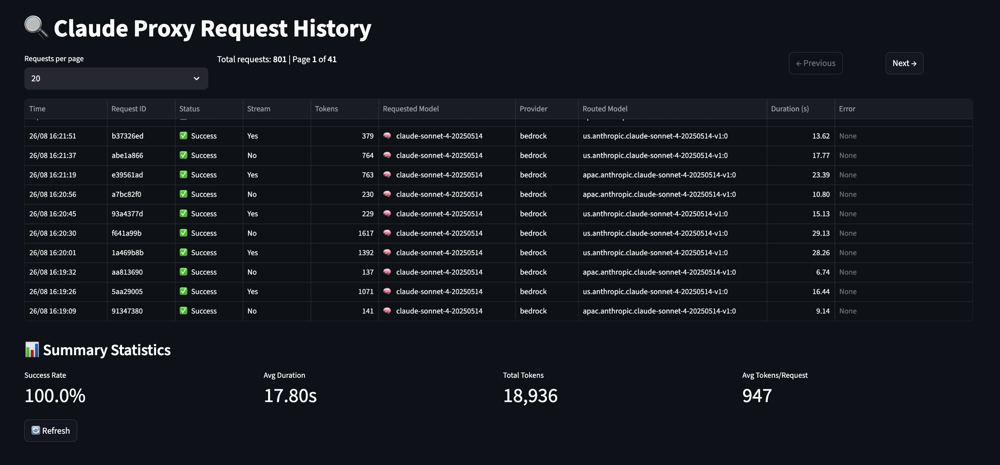

# Claude Proxy

A Python-based proxy server for routing Claude API requests across multiple providers (AWS Bedrock and others) with intelligent fallback, rate limiting, and request monitoring.

## Quick Start

1. **Create config.yaml**:
```yaml
  server:
    port: "3001"
    read_timeout: "300s"
    write_timeout: "300s"
    idle_timeout: "300s"

  providers:
    bedrock:
      region: us-west-2

  routing:
    enable: true
    models:
    -  model: "default"
        provider_sequence:
          - name: "bedrock"
            variants:
              - model: us.anthropic.claude-opus-4-1-20250805-v1:0
                region: us-west-2
              - model: us.anthropic.claude-opus-4-20250514-v1:0
                region: us-west-2
              - model: us.anthropic.claude-sonnet-4-20250514-v1:0
                region: us-west-2
    -  model: "haiku"
        provider_sequence:
          - name: "bedrock"
            variants:
              - model: us.anthropic.claude-3-5-haiku-20241022-v1:0
                region: us-west-2
              - model: us.anthropic.claude-3-5-haiku-20241022-v1:0
                region: us-east-1

    retry_timeout_millis: 1000
    rate_limit_seconds: 10
```

2. **Set AWS credentials** (for Bedrock):
   ```bash
   export AWS_ACCESS_KEY_ID='your_access_key'
   export AWS_SECRET_ACCESS_KEY='your_secret_key'
   ```

3. **Start the proxy**:
   ```bash
   uv run main.py
   ```

## Features

- **Multi-Provider Support**: AWS Bedrock, OpenAI, Cerebras, Groq and OpenRouter integration
- **Intelligent Fallback**: Automatic failover between providers and models
- **Rate Limiting**: Built-in protection against rate limits
- **Streaming Support**: Real-time response streaming
- **Request Monitoring**: SQLite-based request history tracking
- **Web Dashboard**: Streamlit frontend for monitoring requests

## Web Dashboard

The proxy includes a Streamlit web interface for monitoring request history and performance metrics.



Access at: http://localhost:8501

### Features
- **Request History**: View all API requests with pagination
- **Success Metrics**: Track success rates and performance
- **Token Usage**: Monitor token consumption across requests
- **Error Analysis**: Review failed requests and error messages
- **Real-time Stats**: Live updates of proxy performance

### Dashboard Sections
- **Request Table**: Timestamp, status, tokens, provider, duration
- **Summary Stats**: Success rate, average duration, total tokens
- **Pagination**: Navigate through request history
- **Refresh**: Real-time data updates

## Why not directly use the official Claude Bedrock support?

It only allows you to set one model and this quickly times out on most AWS accounts as they are limited to 2 requests per minute without having to go through a lengthy support ticket process. This proxy allows you to specify a few fallback models/regions which allows you to continue requesting without encountering 429. This project also provides a dashboard and more provider support (I like to route Haiku requests to Cerebras so they are instant). Note that Claude Code only uses Haiku requests to generate cosmetic messages (Such as "Thinking...").

## Why not CCR (Claude Code Router)?

CCR is a great project but was not suitable for my personal requirements, and it's complex structure makes it difficult to adjust to my liking. In short:

- Fallback support when encountering 429s (Mostly on Bedrock)
- Dashboard for tracking requests/errors, not for config editing
- Simpler setup/code architecture

## Architecture

```
Client → Proxy Server → Provider Selection → API Provider → Response
```

### Core Components

- **`main.py`**: FastAPI application and server setup
- **`handler.py`**: Request routing and fallback logic
- **`providers.py`**: AWS Bedrock and OpenRouter implementations
- **`models.py`**: Request/response data structures
- **`config.py`**: Configuration management

### Prerequisites
- Python 3.10+
- uv (recommended) or pip

### Install uv (recommended)
```bash
# macOS/Linux
curl -LsSf https://astral.sh/uv/install.sh | sh

# Windows  
powershell -c "irm https://astral.sh/uv/install.ps1 | iex"
```

### Environment Variables

| Variable | Description | Default |
|----------|-------------|---------|
| `PORT` | Server port | `3001` |
| `BEDROCK_REGION` | AWS Bedrock region | `us-east-1` |
| `BEDROCK_ENDPOINT` | Custom Bedrock endpoint | None |
| `OPENROUTER_BASE_URL` | OpenRouter base URL | `https://openrouter.ai` |
| `OPENROUTER_API_KEY` | OpenRouter API key | Required |
| `ROUTING_ENABLE` | Enable provider routing | `false` |
| `RETRY_TIMEOUT_MILLIS` | Retry delay in milliseconds | `1000` |
| `RATE_LIMIT_SECONDS` | Rate limit duration | `60` |

## Usage

### Start the Proxy
```bash
# With uv (recommended)
uv run main.py

# With pip
python main.py
```
Server runs on port 3001 by default.

### API Endpoints

**Main endpoint**: `POST /v1/messages`
```bash
curl -X POST http://localhost:3001/v1/messages \
  -H "Content-Type: application/json" \
  -d '{
    "model": "claude-3-sonnet-20240229",
    "max_tokens": 1000,
    "messages": [{"role": "user", "content": "Hello!"}]
  }'
```

**Other endpoints**:
- `GET /v1/models` - Available models
- `GET /health` - Health check  
- `GET /debug` - Debug info

### Streaming Support
Add `"stream": true` to your request for real-time responses:
```bash
curl -X POST http://localhost:3001/v1/messages \
  -H "Content-Type: application/json" \
  -d '{"model": "claude-3-sonnet-20240229", "stream": true, "max_tokens": 1000, "messages": [{"role": "user", "content": "Tell me a story"}]}'
```

## Provider Routing

The proxy automatically routes requests across providers with intelligent fallback:

1. **Primary Provider**: Try first configured provider
2. **Fallback**: Switch to backup providers on failure  
3. **Rate Limit Handling**: Skip rate-limited providers
4. **Model Variants**: Try alternative models within providers

### Example Flow
```
Request → Bedrock (Sonnet) → Bedrock (Haiku) → OpenRouter (Sonnet) → Response
```

## Development

### Project Structure
```
├── main.py              # FastAPI application
├── handler.py           # Request routing logic
├── providers.py         # AWS Bedrock & OpenRouter implementations
├── models.py            # Data structures
├── config.py            # Configuration management
├── streamlit_app.py     # Web dashboard
└── requirements.txt     # Dependencies
```

### Development Setup
```bash
# Install with dev dependencies
uv sync --extra dev

# Run in development mode  
uv run --reload main.py

# Run tests
uv run test_proxy.py

# Start web dashboard
streamlit run streamlit_app.py
```

### Adding Providers

1. **Implement Provider interface** in `providers.py`
2. **Add configuration** in `config.py` 
3. **Register provider** in `handler.py`

## Troubleshooting

**Common Issues:**
- Verify AWS credentials are configured
- Check OpenRouter API key is set
- Review proxy logs for error details

## License

MIT License 